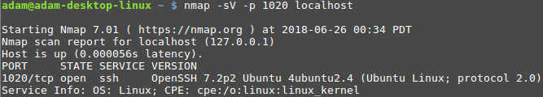

# Fake SSH

Python program to emulate an ssh server as a sort of psuedo-honeypot with some fun commands. It will accept all connections given any provided username/password for authentication.

Utilizes paramiko for the OpenSSH protocol. A generic private key is provided for convenience, although it can be substituted out for another key if desired.

## Usage
This should be able to run on both python 2 and 3 with paramiko as the only requirement

`pip install paramiko`

Then simply run the file to start the server:

`sudo ./fake_ssh.py`

Note: sudo is simply needed to bind to port 22, although this can be easily changed if desired (it will present a generic OpenSSH banner/fingerprint to network scanners to find regardless of the port)

